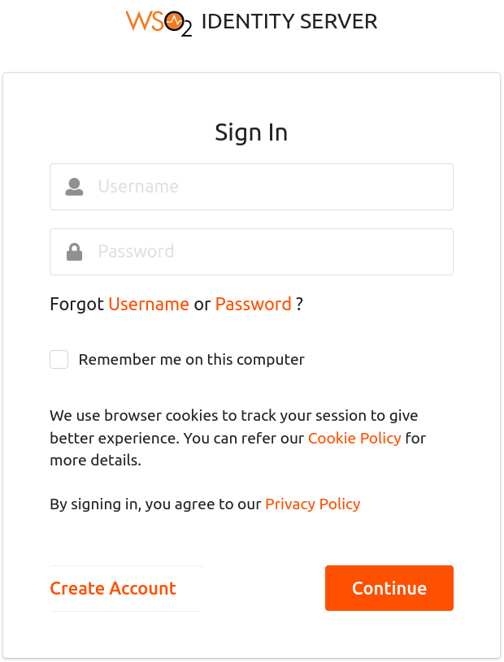
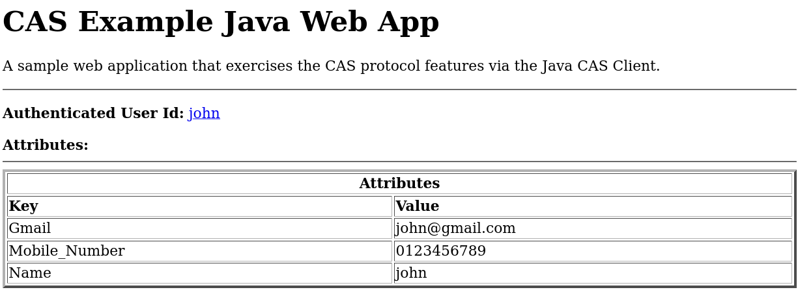

# Configuring CAS Inbound Authenticator

This topic provides instructions on how to configure the CAS inbound authenticator and the WSO2 Identity Server and demonstrates this integration using a sample app (cas-client-webapp). 
 
 ````
 CAS Version 2.0.12 Inbound Authenticator is supported by WSO2 Identity Server versions 5.10.0. 
 ````
 
* [Download and set up CAS](#download-and-set-up-cas)
* [Configuring cas-client-webapp](#configuring-cas-client-webapp)
* [Deploying CAS artifacts](#deploying-cas-artifacts)
* [Configuring the service provider](#configuring-the-service-provider)
* [Testing the sample](#testing-the-sample)

### Download and set up CAS

 * Download WSO2 Identity Server from the [WSO2 Identity Server](https://wso2.com/identity-and-access-management) and install it by following the 
   instructions in the [Installing the Product](https://is.docs.wso2.com/en/latest/setup/installing-the-product) topic.
 * Download the sample CAS client webapp (cas-client-webapp.war) from [https://github.com/wso2-docs/IS/tree/master/IS-Connector-Artifacts/CAS](https://github.com/wso2-docs/IS/tree/master/IS-Connector-Artifacts/CAS)
 * Download the CAS Version 2.0.12 Inbound Authenticator JAR from [the store for this authenticator](https://store.wso2.com/store/assets/isconnector/details/593aac68-3139-425c-b9ca-f66a65a0917a).
 * The CAS login URL is required if you want to use it in your own application. It must be: https://<IS_IP>:9443/identity/cas/login
 * The CAS logout URL is : https://<IS_IP>:9443/identity/cas/logout. (Supports "service" parameter for automatic redirect)

 ### Configuring cas-client-webapp
 1. Generate Keystore to enable 'https' request in your web container (e.g., Tomcat).
 
     a. Use the following "keytool" command inside the "web-container/bin" (e.g., <TOMCAT_HOME/bin>) directory to 
        create a keystore with the self-signed certificate. During the keystore creation process, you need to assign 
        a password and fill in the certificate’s details.
 
        keytool -genkey -alias localhost -keyalg RSA -keystore "PATH_TO_CREATE_KEYSTORE/KEYSTORE_NAME".
       > Here localhost is the same name as the machine's hostname.
     
     b. Add the following connector in the server.xml file in your web-container (e.g., <TOMCAT_HOME>/conf/server.xml)
     
     ```` 
     <Connector port="8443" protocol="HTTP/1.1" SSLEnabled="true"
             maxThreads="150" scheme="https" secure="true"
             clientAuth="false" sslProtocol="TLS"
             keystoreFile="PATH_TO_CREATED_KEYSTORE/KEYSTORE_NAME"
             keystorePass="KEYSTORE_PASSWORD" />
     ```` 
     
       > KEYSTORE_PASSWORD is the password you assigned to your keystore via the "keytool" command.
     
 2. To establish the trust between cas-client-webapp and CAS-Server (WSO2 IS), take the following steps:
 
    a. Go to the <IS_HOME>/repository/resources/security/ directory and execute the following command to create a certificate file for the wso2carbon JKS.
       
       keytool -export -alias wso2carbon -file wso2.crt -keystore wso2carbon.jks -storepass wso2carbon
       
    b. Inside the above directory use the following command to import the CAS server certificate (wso2.crt) into the 
    system truststore of the CAS client. You will be prompted for the keystore password, which is by default 
    **changeit**.
        
       keytool -import -alias wso2carbon -file wso2.crt -keystore PATH-TO-jre/lib/security/cacerts
 
  
 ### Deploying CAS artifacts
    
   1. Place the `cas-client-webapp.war` file into the `webapps` directory of the web-container (e.g., <TOMCAT_HOME>/webapps). 
   2. Place the `org.wso2.carbon.identity.sso.cas-x.x.x.jar` file into the `<IS_HOME>/repository/components/dropins` 
   directory.
   3. Add the configuration below in `deployment.toml` file resides in `<IS_HOME>/repository/conf` directory.
       ````
       [[resource.access_control]]
       context="/identity(.*)"
       secure="false"
       http_method="GET"
       ````
   4. [Start/ Restart the WSO2 Identity Server](https://is.docs.wso2.com/en/latest/setup/running-the-product).

   
   >If you are using WSO2 Identity Server 5.3.0, make sure to take the **WUM** updated product since this 
   feature needs some core fixes done to the product.
 
 
 ### Configuring the service provider
 Now, you are ready to configure WSO2 Identity Server by adding a [new service provider](https://is.docs.wso2.com/en/latest/learn/adding-and-configuring-a-service-provider/).
 
 1. Run [WSO2 Identity Server](https://is.docs.wso2.com/en/latest/setup/running-the-product/).
 2. Log in to the [management console](https://is.docs.wso2.com/en/latest/setup/getting-started-with-the-management-console/#getting-started-with-the-management-console) as an administrator.
 3. In the **Identity** section under the Main tab, click **Add** under **Service Providers**.
 4. Enter **cas-client-webapp** in the **Service Provider Name** text box and click **Register**.
 
    
    
 5. In the **Inbound Authentication Configuration** section, click **CAS Configuration**.
 6. Configure the **Service Url**: [https://localhost:8443/cas-client-webapp/](https://localhost:8443/cas-client-webapp/). 
 
    
    
    >Here service URL refers to the URL of the application/service that the client is trying to access. 
    This is an identifier for one or more URLs where a service or services are located. For example, if the CAS client application has services
    located in **https://example.com/myServices/service1** and **https://example.com/myServices/service2**, you may define
    the service URL as **https://example.com/myServices** because it is the common component for all the service URLs.
    
    >NOTE : If you configure 2 CAS inbound authentication configurations for two service providers with Service URL as 
    **https://example.com/myServices** and **https://example.com/myServices/myService1**, WSO2 IS will always pick the 
    service provider with Service URL **https://example.com/myServices** when the CAS request's 'service' parameter has URLs
    starting from **https://example.com/myServices** (i.e. https://example.com/myServices/**).
                  
    
 7. Go to **Claim Configuration** and click **Define Custom Claim Dialect** to add the requested claims. (This is 
 required to show requested claims as user attributes in the cas-client-webapp; otherwise, no attributes will be 
 shown.) Add the **Service Provider Claim** name that corresponds to the **Local Claim** URI and mark it as **Requested 
 Claim**.
    
    
    
 8. Click **Update** to save the changes. Now you have configured the service provider.
 
 ### Testing the sample
 
 1. To test the sample, navigate to https://[server-address]/cas-client-webapp/ in your browser (i.e., go to the 
 following URL: [https://localhost:8443/cas-client-webapp/](https://localhost:8443/cas-client-webapp/)).
 2. Use your IS username and password in the basic authentication.
    
    
    
 3. If you have successfully logged in, you will see the following CAS Home page of cas-client-webapp with the authenticated user and user attributes.
    
    